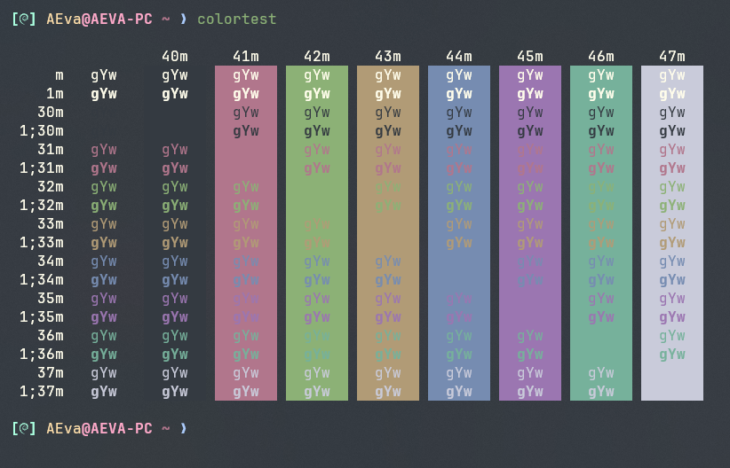
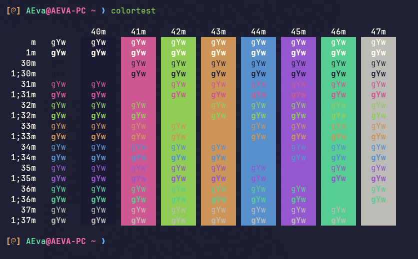

# Oneiroi theme for [Windows Terminal](https://github.com/microsoft/terminal)

> A fantastic theme for `Windows Terminal`.  

<p align="center">
  
</p>

<p align="center">
  <a href="https://github.com/OneiroiTheme/windows-terminal/stargazers"></a>
  <a href="https://github.com/OneiroiTheme/windows-terminal/issues"></a>
  <a href="https://github.com/OneiroiTheme/windows-terminal/contributors"></a>
</p>

## Themes available

- oneiroi dream

<p align="center">
  
</p>

- oneiroi melatonin

<p align="center">
  
</p>

## Installation

1. Click the dropdown menu (next to the tabs) and select Settings.
2. On the left menu, select `Open JSON file`
3. Pick one of the themes from the repository(e.g. oneiroi-dream.json)
4. In the `settings.json` file,Find the section called "Schemes" and paste your chosen theme inside of schemes array `[ ]`.
5. Add or update the "colorScheme" property to use your custom scheme:

     ```json
     "profiles": {
         "defaults": {
             "colorScheme": "oneiroi dream"
         }
     }
     ```

6. Save the `settings.json` file and enjoy.

Hello fantasy world!🎉
